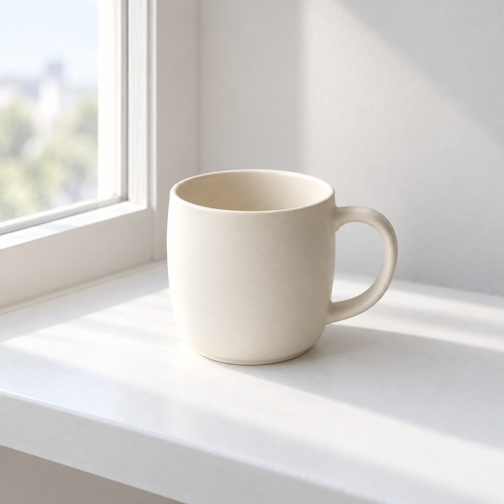

# Chapter 19 다른 장면에서 같은 잔 유지

[예제 목록](README.md) · [책 본문](../pages/044-ch19.md)

## 실습 목표

기준 이미지의 잔을 창가 장면으로 옮기고 외형을 비교합니다.

아래 코드 블록의 내용만 복사해 이미지 생성 도구에 입력하세요. 편집 단계에서는 지정한 입력 파일을 먼저 첨부합니다.

## 1. 창가의 잔

입력 이미지: [mug-original.png](../assets/mug-original.png). 파일을 내려받아 첨부하세요.

```text
첨부 이미지는 잔의 형태를 참고할 기준 이미지입니다. 같은 크림색 무광 도자기 잔 하나를 창가의 흰 선반 위에 놓은 새로운 정사각형 사진을 만들어 주세요. 잔의 원통형 몸체, 위 테두리의 두께, 둥근 오른쪽 손잡이와 크림색 표면을 유지합니다. 잔 전체가 보이게 하고 왼쪽에 창틀 일부와 밝은 창밖을 배치합니다. 창가의 부드러운 빛을 사용합니다. 글자, 로고, 사람, 다른 소품은 넣지 마세요.
```

### 수록 결과



AI 생성 이미지. Codex 내장 imagegen, 모델 ID 미공개, 2026-10-05. PNG 1254×1254, RGB. 생성 1회, 수록 1장.

[결과 파일 열기](../assets/mug-shelf.png)

### 결과 관찰

충족한 조건: 왼쪽 창틀과 흰 선반이 생겼고 크림색 무광 몸체와 둥근 오른쪽 손잡이가 이어집니다.

달라진 점: 원본보다 잔이 화면에서 작게 보이고, 손잡이 안쪽 윤곽과 테두리의 보이는 폭에 차이가 있습니다.

판정: 장면 변경 성공, 개체 일관성 부분 충족.

## 바꿔 볼 조건

몸체 비율, 테두리, 손잡이를 고정 항목으로 정한 뒤 배경 장소 하나만 바꾸세요.

응용 과제는 위에 수록한 실제 실행 기록에 포함되지 않습니다.

[책의 설명과 검수 기준](../pages/044-ch19.md) · [예제 목록](README.md)
