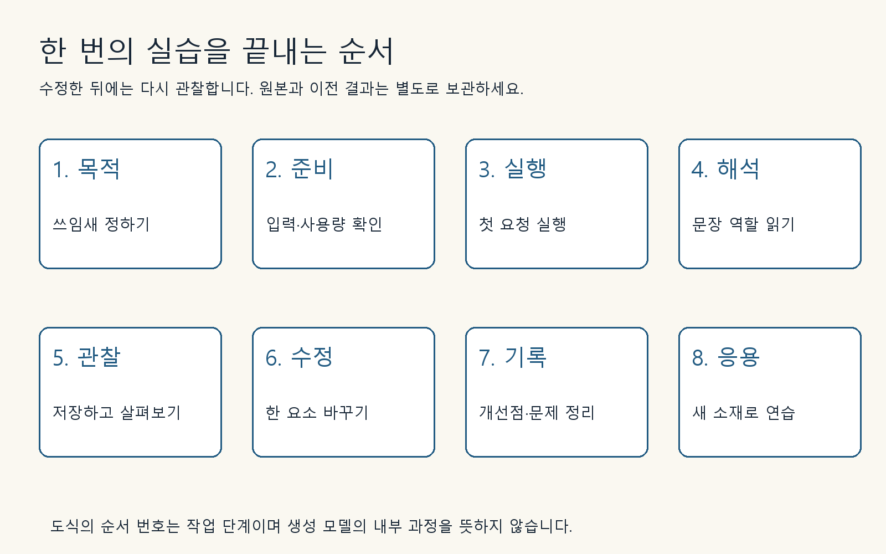

## 먼저 작업 폴더를 만듭니다

컴퓨터에 `image-practice`라는 폴더를 만들고 그 안에 `input`, `output`, `notes` 폴더를 만드세요. input에는 본인이 사용할 권한이 있는 원본, output에는 생성 결과, notes에는 프롬프트와 관찰 내용을 저장합니다. 휴대전화라면 같은 이름의 앨범이나 파일 폴더를 사용해도 됩니다. 사용한 원본은 덮어쓰지 않습니다.

실습을 시작할 때 서비스 이름, 화면에 표시된 모델명, 날짜, 이미지 수와 비율 설정을 기록하세요. 모델명이 보이지 않으면 ‘미공개’라고 적습니다. 제품 이름과 모델 이름을 추측해서 같은 칸에 쓰지 않는 것이 중요합니다. 예를 들어 ChatGPT는 서비스 이름이고, 그 안에서 이미지 생성에 쓰인 정확한 모델은 별도로 확인해야 합니다.

## 한 번의 실습을 끝내는 여덟 단계

직접 작성한 교육용 도식입니다. 생성 모델의 내부 동작을 표현한 그림은 아닙니다.

1. 어디에 쓸 이미지인지 한 문장으로 적습니다.
2. 입력 사진과 계정의 사용량을 확인합니다.
3. 첫 프롬프트를 복사해 실행합니다.
4. 프롬프트의 각 구절이 무슨 역할인지 읽습니다.
5. 실제 결과를 저장하고 관찰합니다.
6. 바꿀 요소 하나를 정해 수정합니다.
7. 좋아진 점과 남은 문제를 따로 기록합니다.
8. 소재를 바꿔 같은 원리를 연습합니다.

‘실제 실행’이라고 적힌 사례에는 이 책 제작 중 얻은 이미지가 연결되어 있습니다. ‘독자 과제’는 스스로 실행할 연습이며 책 제작 중의 실험 결과가 아닙니다. 본문의 수치 예제에서 비용이나 시간은 계산을 이해하기 위한 가정인지 실제 기록인지 구분합니다.

## 결과를 평가할 때의 약속

먼저 필수 조건을 확인하고 나중에 취향을 평가합니다. 잔이 하나여야 한다면 두 개가 나온 이미지는 색이 마음에 들어도 수정 대상입니다. 반대로 정확한 색 코드가 중요한 작업이 아니라면 아주 작은 색 차이에 시간을 모두 쓰지 않아도 됩니다. 목적과 관계없는 흠을 무한히 고치는 습관도 피해야 합니다.

이미지는 화면을 크게 해서 한 번, 실제 쓰일 크기로 줄여서 한 번 봅니다. 확대했을 때만 보이는 문제와 작은 화면에서 전달력이 떨어지는 문제는 다릅니다. 실습 결과가 책과 다를 때는 잘못했다고 생각하기 전에 프롬프트, 입력 이미지, 설정이 같은지 먼저 확인하세요.

[이전 페이지](001-introduction.md) · [전체 목차](../TOC.md) · [다음 페이지](010-part1.md)
