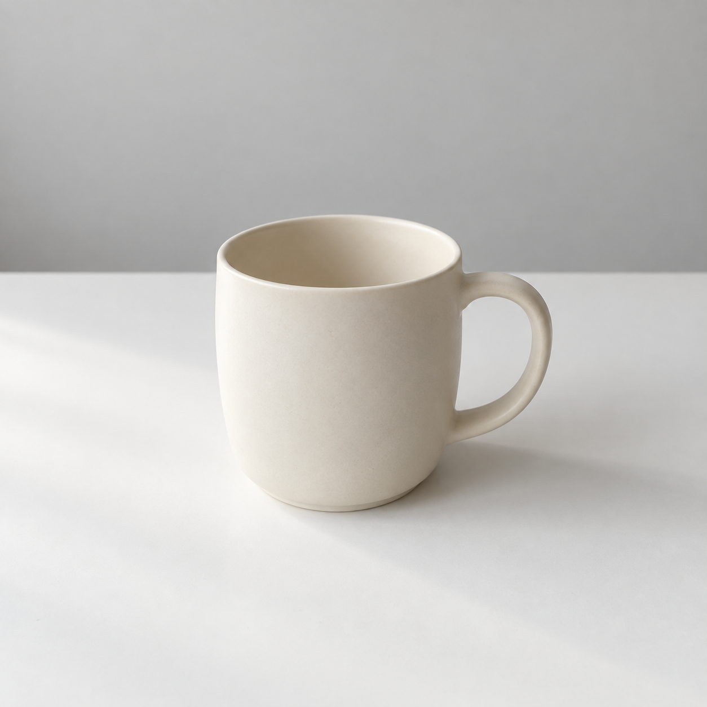

## 이번에 만들 결과

흰 탁자 위의 크림색 도자기 잔 한 장을 만듭니다. 다른 소품이 없어야 잔의 모양과 배경을 쉽게 비교할 수 있습니다. 준비물은 이미지 생성 도구와 결과를 저장할 폴더입니다. 입력 사진은 필요 없습니다.

## 입력부터 저장까지

1. 사용하는 서비스에 로그인하고 새 대화를 엽니다. 별도 이미지 생성 화면이 있는 도구라면 그 화면을 엽니다.
2. 이미지 생성 기능을 선택할 수 있다면 선택합니다. 비율 설정이 보이면 정사각형 또는 1:1로 정합니다.
3. 아래 프롬프트를 복사해 입력창에 붙여 넣고 실행합니다. 처리 중에는 같은 요청을 여러 번 보내지 않습니다.
4. 이미지가 나오면 크게 열어 잔과 손잡이를 확인합니다. 설명문만 나왔다면 이미지 생성 기능을 사용할 수 있는지 다시 확인합니다.
5. 이미지의 다운로드 또는 저장 기능으로 파일을 받습니다. 버튼의 이름과 위치는 서비스마다 다릅니다.
6. output 폴더에 `mug-original`이라는 식별 가능한 이름으로 보관하고 저장한 파일을 다시 엽니다. 다운로드된 확장자는 임의로 바꾸지 않습니다.

다운로드 권한을 묻는 창이 뜨면 저장 위치를 확인합니다. 파일을 찾기 어렵다면 브라우저의 다운로드 목록에서 해당 파일의 폴더를 엽니다. 화면을 캡처한 이미지는 내려받은 원본과 크기가 다를 수 있으므로 원본 다운로드를 우선합니다.

## 첫 프롬프트

```text
크림색 무광 도자기 잔 하나를 흰색 탁자 위에 놓은 사진을 만들어 주세요. 손잡이는 오른쪽에 있고 잔 전체가 보이게 합니다. 배경은 아무 무늬 없는 연한 회색입니다. 왼쪽 창문에서 들어오는 부드러운 빛을 사용하고, 그림자는 오른쪽으로 자연스럽게 드리웁니다. 눈높이보다 조금 위에서 바라보며 정사각형 화면 중앙에 잔을 배치합니다. 글자, 로고, 사람, 다른 소품은 넣지 마세요.
```

‘잔 하나’는 대상과 수량, ‘크림색 무광 도자기’는 색과 재질입니다. ‘흰색 탁자’와 ‘연한 회색’은 바닥과 배경을 구분합니다. 시점, 조명, 화면 비율까지 지정했으므로 모델이 결정할 범위가 줄었습니다. 마지막 문장은 필요하지 않은 요소를 제한합니다.

## 실제 생성 결과



AI 생성 이미지. Codex 내장 imagegen, 모델 ID 미공개, 2026-10-05 제작. PNG 1254×1254, 불투명 RGB. 한 번 생성한 결과를 수록했습니다.

잔 하나와 오른쪽 손잡이가 보이며, 잔 위쪽의 안쪽 면이 보여 시점도 요청과 대체로 맞습니다. 탁자와 벽의 경계가 수평으로 나타나 있습니다. ‘중앙’이라는 지시에도 잔과 손잡이를 합친 시각적 무게는 오른쪽으로 느껴질 수 있습니다.

## 한 요소 수정

원본을 첨부하고 배경만 연한 파란색으로 바꾸는 지시를 이어서 실행했습니다. 전체 수정 프롬프트와 실제 수정본은 [Chapter 16](https://wikidocs.net/444334)에 있습니다. 독자는 배경색 이외의 문장을 바꾸지 않고 두 결과를 비교하세요.

독자 과제: 잔을 작은 그릇으로 바꾸어 생성합니다. 이때 손잡이 지시는 삭제해야 합니다. 단어 하나만 기계적으로 바꾸면 새 대상에 맞지 않는 조건이 남을 수 있다는 점을 확인하세요.

[이전 페이지](https://wikidocs.net/444318) · [전체 목차](https://wikidocs.net/book/21518) · [다음 페이지](https://wikidocs.net/444320)
