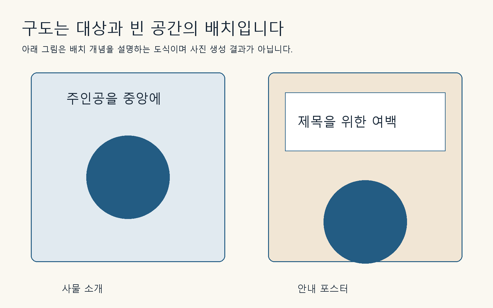

## 구도는 화면 안에서의 자리입니다

구도는 대상과 주변 요소를 화면에 배치하는 방식입니다. 주인공을 한가운데 놓으면 안정감이 생기고, 옆으로 옮기면 다른 쪽에 글자를 넣을 공간을 만들 수 있습니다. 어느 구도가 항상 좋은 것은 아닙니다. 이미지가 쓰일 자리에서 무엇을 전달해야 하는지가 기준입니다.

시점은 바라보는 위치입니다. 탁자 위를 수직으로 내려다보는 장면은 물체의 배열을 보여 주기 좋습니다. 눈높이에 가까운 장면은 물체의 높이와 옆면을 보여 줍니다. 잔 안에 담긴 음료와 잔의 외형을 함께 보여 주려면 조금 위에서 비스듬히 바라보는 요청이 유용합니다.

‘클로즈업’은 대상을 가까이 크게 보여 주는 표현입니다. 가까워질수록 전체 모양이 잘릴 수 있으므로 상품 전체가 필요할 때는 ‘대상의 모든 가장자리가 화면 안에 들어오게’라고 덧붙입니다. ‘전체가 보이는 극단적인 클로즈업’처럼 서로 잡아당기는 지시는 우선순위를 정리하세요.

## 여백도 내용입니다

포스터에서는 빈 공간이 제목을 위한 자리입니다. ‘여백을 많이’보다 ‘오른쪽 3분의 1은 글자를 넣을 수 있게 물체 없이 비워 두기’가 더 구체적입니다.

이 그림은 구도 이해를 위해 직접 작성한 도식입니다. 사진 생성 결과가 아니며, 배치의 개념을 설명합니다. 배경에 무늬가 많으면 물체가 없어도 글자를 읽기 어려울 수 있습니다. 빈 공간은 ‘사물이 없는 공간’과 ‘글자가 읽히는 공간’을 함께 만족해야 합니다.

독자 과제: 잔 사진을 블로그 제목 이미지로 쓴다고 생각하고 주인공을 왼쪽, 오른쪽 중 어느 쪽에 놓을지 정하세요. 제목의 줄 수와 길이를 먼저 적은 뒤 여백을 지정합니다. 이미지를 만들고 나서 문구를 억지로 밀어 넣는 순서보다 시행착오를 줄일 수 있습니다.

[이전 페이지](021-ch06.md) · [전체 목차](../TOC.md) · [다음 페이지](023-ch08.md)
