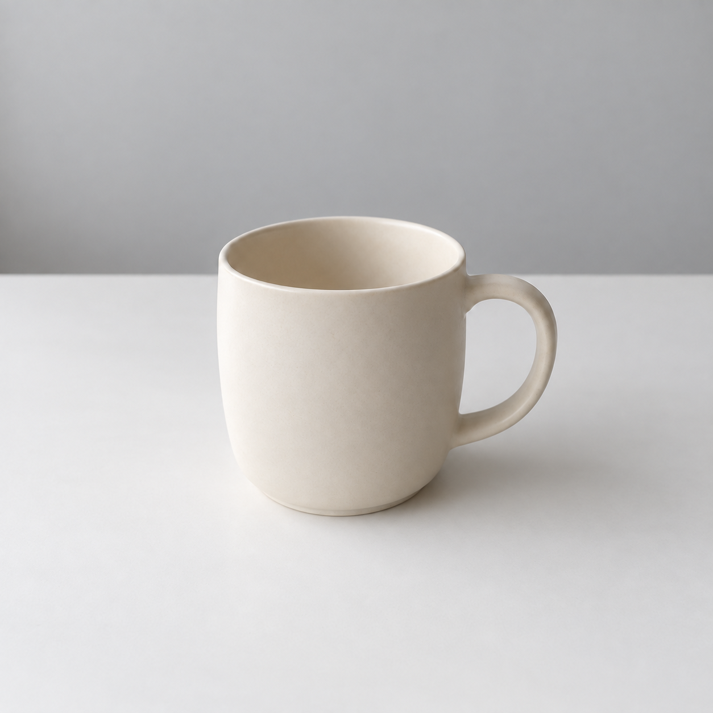

## 밝기와 빛의 방향은 다릅니다

‘밝은 사진’은 전체 느낌을 알려 주지만 빛의 위치는 알려 주지 않습니다. 왼쪽 창문에서 들어오는 빛, 정면의 넓은 조명, 뒤에서 들어오는 저녁빛은 같은 물체를 다르게 보이게 합니다. 빛의 방향을 적으면 그림자를 관찰할 기준도 생깁니다.

부드러운 빛은 밝은 부분과 어두운 부분의 경계가 완만하게 이어지는 느낌입니다. 구름 낀 날의 창가를 떠올리면 쉽습니다. 강한 직사광선은 경계가 또렷한 그림자를 만들 수 있습니다. ‘부드러운 빛’과 ‘선명하고 단단한 그림자’를 함께 요구할 수는 있지만, 입문 실습에서는 한 방향으로 일관되게 설명하는 편이 낫습니다.

그림자는 물체가 바닥에 놓여 있다는 느낌을 줍니다. 그림자를 모두 없애면 상품 목록에는 깔끔할 수 있어도 공중에 떠 있는 것처럼 보일 수 있습니다. ‘잔 아래에 옅은 접촉 그림자만’이라고 쓰면 바닥과 맞닿는 작은 어둠을 남기려는 의도가 전달됩니다.

## 사진 용어를 몰라도 설명할 수 있습니다

촬영 장비 이름을 억지로 나열할 필요는 없습니다. ‘흰 커튼을 통과한 아침빛처럼 부드럽게’라는 일상적인 설명도 출발점이 됩니다. 전문 용어를 쓸 때는 그것이 실제 화면에서 어떤 차이를 만드는지 이해하고 사용하세요. 카메라 이름을 적었다고 실제 장비로 촬영했다는 뜻도 아닙니다.

같은 잔 원본을 두 번 별도로 첨부하고 조명 조건만 바꾸었습니다. 직사광 결과를 확산광 편집의 입력으로 사용하지 않았습니다. 원본은 [Chapter 4](014-ch04.md)에서 확인할 수 있습니다.

## 실제 실행 1: 흐린 날의 확산광

```text
첨부 이미지에서 빛의 느낌만 바꿔 주세요. 흐린 날 창가에서 촬영한 듯 그림자의 경계를 부드럽게 합니다. 잔의 모양, 색, 위치와 배경색은 유지하세요.
```



AI 생성 이미지. Codex 내장 imagegen, 모델 ID 미공개, 2026-10-05. PNG 1254×1254, RGB. 생성 1회, 수록 1장.

입력 파일: `mug-original.png`.

충족한 조건: 잔 하나, 오른쪽 손잡이, 회색 벽과 흰 탁자가 유지되고 오른쪽 그림자가 완만합니다.

달라진 점: 원본도 부드러운 조명이어서 새 결과의 변화 폭은 작습니다.

판정: 유지 조건 충족, 조명 변화는 육안으로 작게 관찰됨.

## 실제 실행 2: 오후의 강한 직사광

```text
첨부 이미지에서 빛의 느낌만 바꿔 주세요. 오후의 강한 직사광이 왼쪽 창문에서 들어오며 잔 오른쪽 탁자에 경계가 선명한 그림자를 만듭니다. 잔의 모양, 색, 위치와 배경색은 유지하세요.
```


AI 생성 이미지. Codex 내장 imagegen, 모델 ID 미공개, 2026-10-05. PNG 1254×1254, RGB. 생성 1회, 수록 1장.

입력 파일: `mug-original.png`.

충족한 조건: 잔 오른쪽의 그림자가 길고 선명해졌습니다. 잔의 주요 외형과 위치도 유지되었습니다.

달라진 점: 탁자에 대각선의 밝은 띠와 어두운 영역이 생겼고 잔 안쪽에도 선명한 명암 경계가 나타났습니다.

판정: 직사광 표현 성공, 장면 전체의 명암 변화 동반.

두 결과에서 먼저 그림자 경계를 비교하고, 이어 잔 안쪽과 탁자의 밝은 부분을 보세요. 직사광 결과에 생긴 밝은 띠는 프롬프트에 세부 모양을 지정하지 않았던 부분입니다.

독자 응용: 같은 원본에서 빛의 방향만 오른쪽으로 바꿔 보세요. 그림자 위치와 손잡이 안쪽의 명암이 함께 달라지는지 기록합니다.

[이전 페이지](022-ch07.md) · [전체 목차](../TOC.md) · [다음 페이지](024-ch09.md)
