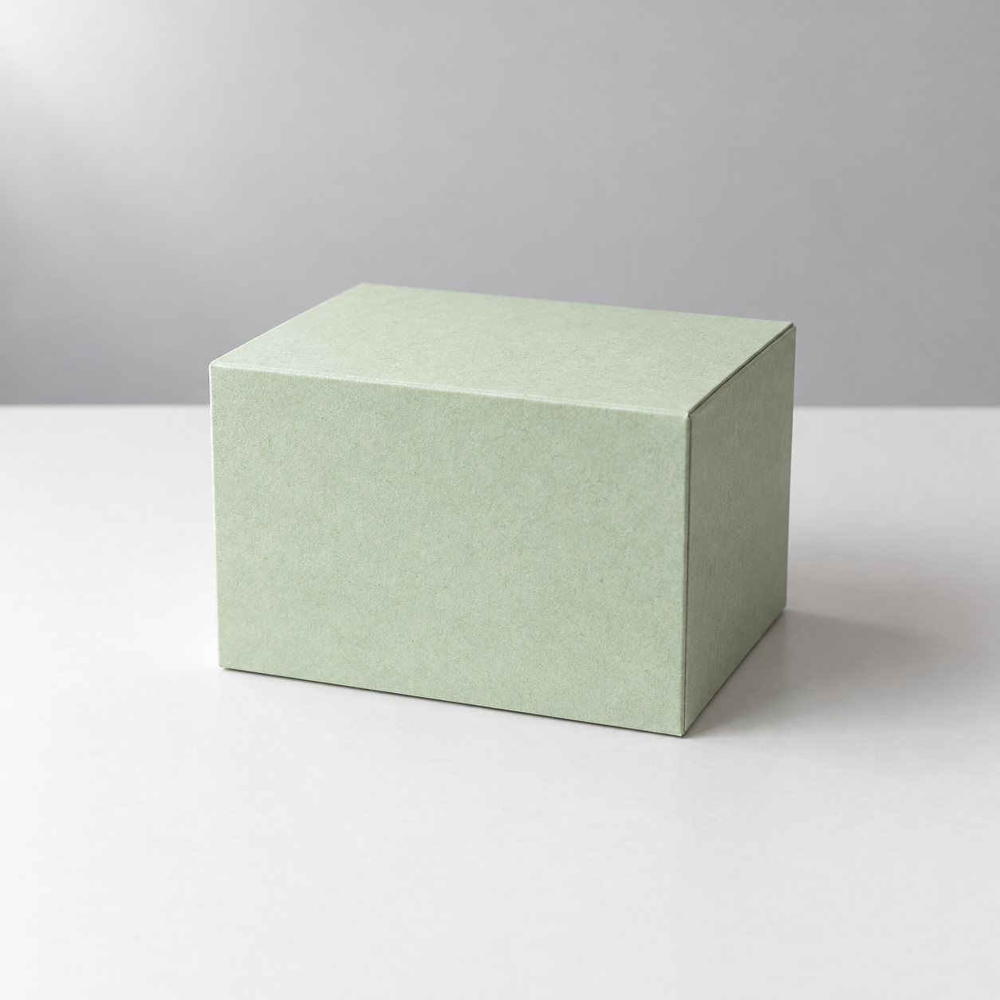
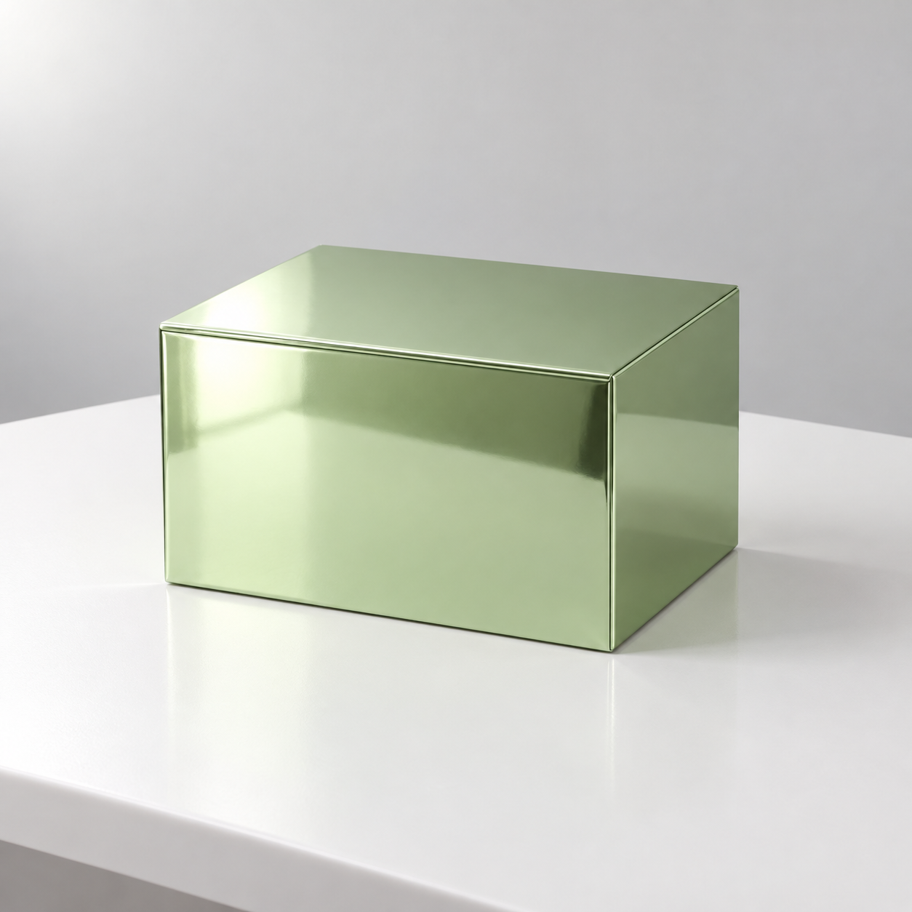

## 색이 같아도 물체의 느낌은 달라집니다

흰색 종이, 흰색 도자기, 흰색 플라스틱은 모두 흰색이지만 표면이 다릅니다. 종이는 섬유와 얇은 가장자리, 도자기는 두께와 미세한 표면 변화, 플라스틱은 균일한 표면처럼 관찰 지점이 달라집니다. 재질을 쓰면 색만으로 설명하기 어려운 차이를 전달할 수 있습니다.

무광은 반짝임이 강하지 않은 표면을, 유광은 빛이 비교적 뚜렷하게 반사되는 표면을 말합니다. ‘무광 도자기 잔’에 ‘거울처럼 강한 반사’를 덧붙이면 서로 다른 표면을 동시에 요구하게 됩니다. 혼합 재질이 필요한 경우에는 ‘몸체는 무광, 손잡이만 금속 광택’처럼 위치를 나누세요.

색도 역할을 나누어 고르면 편합니다. 바탕색은 화면의 큰 면적, 주조색은 주인공, 강조색은 시선을 끌 작은 부분에 씁니다. 처음에는 색을 두세 가지로 제한해 보세요. 원하는 분위기가 뚜렷해지고 나중에 글자를 얹을 때도 비교하기 쉽습니다.

## 색 코드는 최종 확인을 대신하지 않습니다

색 코드는 색을 특정하는 표기입니다. 예를 들어 `#1E4F86` 같은 값은 편집 프로그램에서 색을 지정할 때 사용할 수 있습니다. 조명과 그림자가 있는 사진에서는 같은 물체 안에서도 픽셀값이 달라집니다.

로고의 지정 색이 정확해야 하는 작업이라면 마지막 단계에서 일반 편집 도구로 색과 글자를 적용하고 확인합니다.

같은 문장 구조에서 재질 설명만 바꾸어 각각 텍스트로 생성했습니다. 첫 결과를 두 번째 생성의 참조 이미지로 첨부하지 않았습니다.

## 실제 실행 1: 무광 종이 상자

```text
가상의 연한 녹색 직육면체 상자 하나를 흰 탁자 중앙에 놓은 제품 사진을 만들어 주세요. 상자는 무광 종이 재질이며 표면에 미세한 종이 섬유가 보입니다. 앞면, 오른쪽 옆면, 윗면이 보이도록 눈높이보다 조금 위에서 바라봅니다. 상자 전체가 보이는 정사각형 화면, 아무 무늬 없는 연한 회색 배경, 왼쪽 위의 부드러운 빛을 사용합니다. 글자, 로고, 리본, 다른 물건은 넣지 마세요.
```



AI 생성 이미지. Codex 내장 imagegen, 모델 ID 미공개, 2026-10-05. PNG 1254×1254, RGB. 생성 1회, 수록 1장.

충족한 조건: 연한 녹색 상자 하나의 앞면·오른쪽 면·윗면이 보입니다. 표면에는 섬유처럼 거친 질감이 있고 강한 반사는 없습니다.

달라진 점: 미세한 질감 때문에 밝은 면의 색이 고르게 보이지 않습니다.

판정: 무광 종이 표현과 기본 구성 충족.

## 실제 실행 2: 광택 금속 상자

```text
가상의 연한 녹색 직육면체 상자 하나를 흰 탁자 중앙에 놓은 제품 사진을 만들어 주세요. 상자는 광택 있는 금속 재질이며 표면에 주변의 빛이 뚜렷하게 반사됩니다. 앞면, 오른쪽 옆면, 윗면이 보이도록 눈높이보다 조금 위에서 바라봅니다. 상자 전체가 보이는 정사각형 화면, 아무 무늬 없는 연한 회색 배경, 왼쪽 위의 부드러운 빛을 사용합니다. 글자, 로고, 리본, 다른 물건은 넣지 마세요.
```



AI 생성 이미지. Codex 내장 imagegen, 모델 ID 미공개, 2026-10-05. PNG 1254×1254, RGB. 생성 1회, 수록 1장.

충족한 조건: 연한 녹색 상자에 넓고 강한 반사와 가느다란 모서리 광택이 나타났습니다.

달라진 점: 종이 결과보다 상자가 조금 더 넓게 보이고 탁자 경계가 기울어졌습니다. 색도 더 짙게 느껴집니다.

판정: 금속 표현 성공, 두 결과의 구도·색 일치 부분 실패.

반사와 표면 질감을 비교하면 재질 차이가 잘 드러납니다. 두 결과의 상자 윤곽과 탁자 경계는 서로 달라서, 재질 외 조건을 더 엄격히 맞추려면 같은 원본을 편집하는 다음 실험이 필요합니다.

독자 응용: 종이 상자 결과를 첨부하고 재질만 금속으로 바꿔 보세요. 이번 텍스트 생성 두 장과 비교해 구도 유지에 어떤 차이가 있는지 적습니다.

[이전 페이지](https://wikidocs.net/444324) · [전체 목차](https://wikidocs.net/book/21518) · [다음 페이지](https://wikidocs.net/444326)
