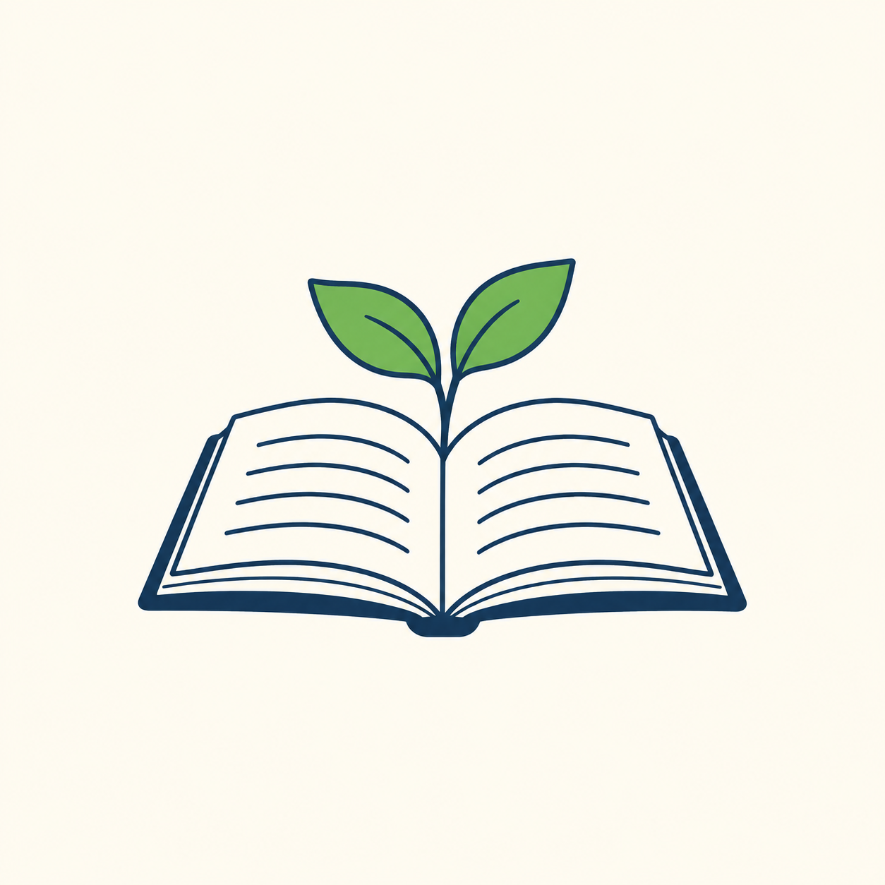

## 무엇을 생략할지 정하는 일

사진처럼 보이는 이미지는 표면과 빛의 세부 정보가 많습니다. 일러스트는 목적에 따라 그 정보를 줄이거나 강조합니다. 설명 자료에는 간단한 형태가 더 잘 맞을 때가 있고, 음식의 질감을 보여 주려면 사진 같은 표현이 유리할 때가 있습니다. 둘은 우열이 아니라 전달 방식의 차이입니다.

‘일러스트’만 쓰면 범위가 넓습니다. ‘굵은 윤곽선, 평평한 색면, 그림자 최소화’라고 덧붙이면 단순한 교육용 그림에 가까워집니다. ‘종이의 결이 보이고 색이 가장자리에서 번지는 수채화 느낌’이라고 하면 질감과 색의 변화가 중요한 그림을 요청하는 셈입니다.

특정 작가의 이름을 모르더라도 화면의 특징을 설명할 수 있습니다. 선의 굵기, 색의 수, 표면의 질감, 생략하는 세부를 관찰하세요. 이 책의 예문은 특정 현존 작가나 실제 브랜드의 고유한 표현을 재현하는 방식으로 구성하지 않았습니다.

## 독서 삽화의 실제 예

AI 생성 이미지. Codex 내장 imagegen, 모델 ID 미공개, 2026-10-05. PNG 1254×1254, RGB. 전체 프롬프트와 배경 제거 과정은 [Chapter 22](052-ch22.md)에 있습니다.

남색 선과 초록색 잎이 중심이고, 종이에는 글자 대신 곡선이 그려져 있습니다. 요청은 단순한 평면 표현이었지만 잎 안쪽에는 색의 변화가 남았습니다. ‘평면’이라고 썼다고 완전히 균일한 벡터 도형이 생성된 것은 아닙니다. 파일도 벡터가 아니라 픽셀로 된 PNG입니다.

독자 과제: 독서 모임 안내에 이 그림을 쓴다면 세부를 더 늘릴지, 줄일지 판단해 보세요. 휴대전화의 작은 화면에서 볼 용도라면 책과 새싹이라는 두 요소만 남기는 선택에 이유가 있습니다. 표현 방식을 고를 때는 결과가 보일 크기도 함께 고려합니다.

[이전 페이지](024-ch09.md) · [전체 목차](../TOC.md) · [다음 페이지](030-part3.md)
