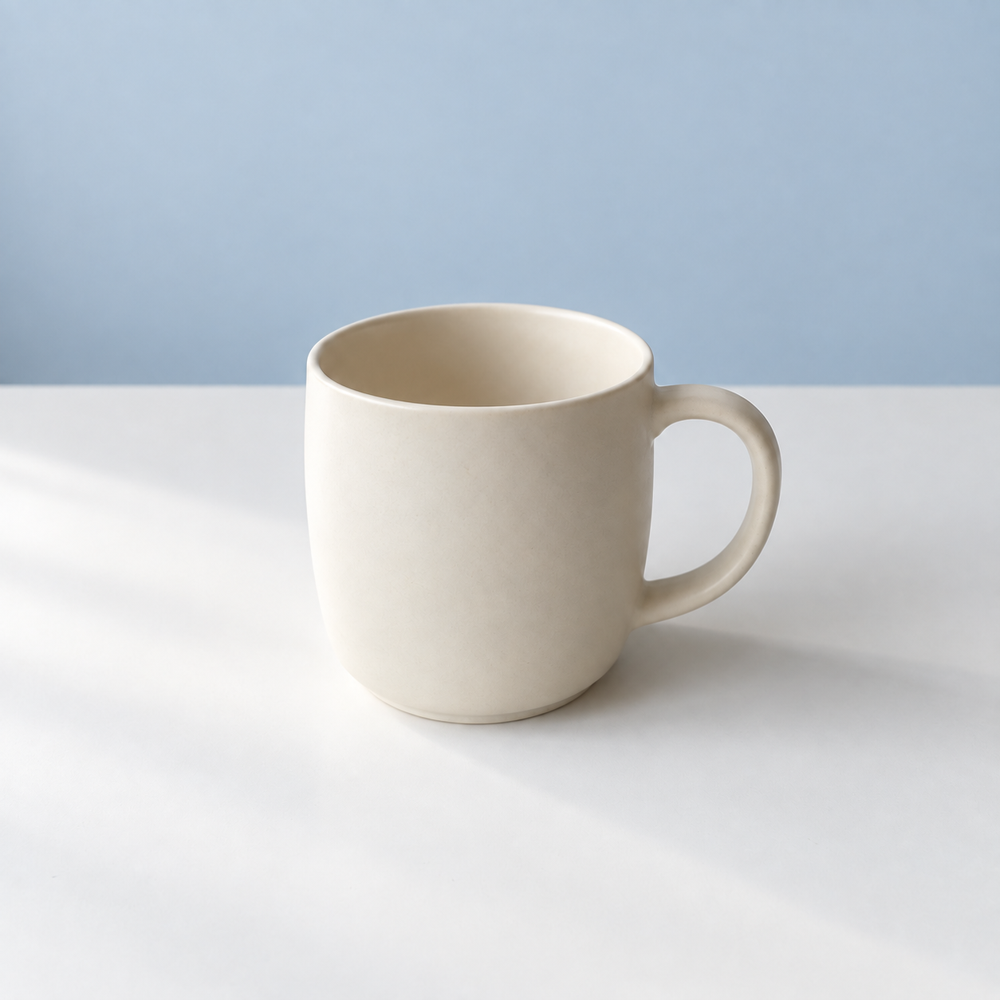
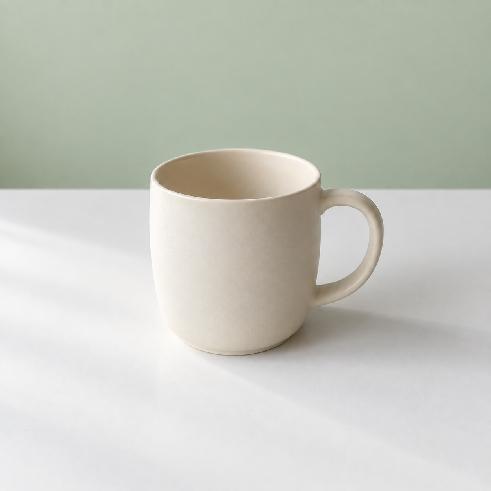

## 준비물과 목표

준비물은 [첫 잔 이미지](../assets/mug-original.png)와 이미지 입력을 지원하는 편집 도구입니다. 목표는 잔을 유지하면서 회색 벽을 연한 파란색으로 바꾸는 것입니다. 새 이미지를 따로 생성하는 작업과 구분하려면 원본 파일을 반드시 첨부하세요.

먼저 도구의 파일 첨부 기능으로 저장한 원본을 선택합니다. 업로드가 끝나고 미리보기에 올바른 잔이 보이는지 확인한 다음 아래 수정 문장을 입력합니다. 결과는 원본과 다른 이름인 `mug-blue`로 저장하세요. 서로 다른 두 파일을 같은 크기로 열어 비교하며, 원본 위에 저장하지 않습니다.

## 실제 실행한 수정 프롬프트

```text
첨부한 이미지를 편집해 주세요. 잔 뒤의 연한 회색 배경만 차분한 연한 파란색으로 바꾸세요. 크림색 도자기 잔의 모양, 손잡이 방향, 크기와 위치, 흰색 탁자, 왼쪽에서 들어오는 빛, 그림자, 정사각형 구도는 유지합니다. 소품과 글자는 추가하지 마세요.
```

첫 문장은 편집 대상을, 둘째 문장은 변경 범위를 지정합니다. 나머지는 유지 조건입니다. 흰 탁자까지 파랗게 바뀌지 않도록 ‘잔 뒤의 배경’과 ‘흰색 탁자’를 구분했습니다. 일상적으로는 둘 다 배경이라 부를 수 있지만 편집에서는 위치를 좁히는 표현이 필요합니다.

## 실제 수정 결과



AI 편집 이미지. Codex 내장 imagegen, 모델 ID 미공개, 2026-10-05. 원본 mug-original.png를 입력해 한 번 편집했습니다. 출력은 PNG 1254×1254, RGB입니다.

벽이 파란색으로 바뀌었고 흰 탁자와 잔은 육안으로 유사하게 유지되었습니다. 손잡이 방향과 잔의 화면 속 위치도 큰 변화 없이 보입니다.

## 관찰과 응용

두 이미지를 같은 확대 비율로 열고 벽, 탁자, 잔 가장자리 순서로 봅니다. 벽의 색만 마음에 든다고 검수를 끝내지 마세요. 잔 손잡이 안쪽의 배경도 자연스럽게 바뀌었는지, 가장자리에 원래 배경의 테두리가 남았는지도 확인합니다.

## 실제 실행: 원본에서 녹색 배경으로

파란색 수정본이 아닌 처음의 회색 배경 파일을 첨부했습니다. 원본에서 바로 분기하면 중간 수정본의 변화를 이어받지 않고 새 조건을 관찰할 수 있습니다.

```text
첨부한 원본 잔 사진에서 배경 벽의 색만 연한 녹색으로 바꿔 주세요. 크림색 잔의 모양, 크기, 손잡이, 위치, 흰 탁자, 조명과 그림자는 유지하세요. 새 물건이나 글자는 넣지 마세요.
```



AI 생성 이미지. Codex 내장 imagegen, 모델 ID 미공개, 2026-10-05. PNG 1254×1254, RGB. 생성 1회, 수록 1장.

입력 파일: `mug-original.png`.

충족한 조건: 벽과 손잡이 안쪽 배경이 연한 녹색으로 바뀌었습니다. 흰 탁자, 잔 위치와 오른쪽 손잡이는 유사하게 유지되었습니다.

달라진 점: 잔 표면의 밝은 부분은 원본과 미세하게 다르게 보입니다.

판정: 배경색 변경 성공, 주요 외형 육안 보존.

독자 응용: 같은 원본의 벽을 옅은 살구색으로 바꾸고 잔 가장자리와 손잡이 안쪽을 검사합니다. 비교할 때는 원본, 파란색, 녹색, 자신의 수정본에 각각 파일명을 붙여 혼동을 줄이세요.

[이전 페이지](040-part4.md) · [전체 목차](../TOC.md) · [다음 페이지](042-ch17.md)
