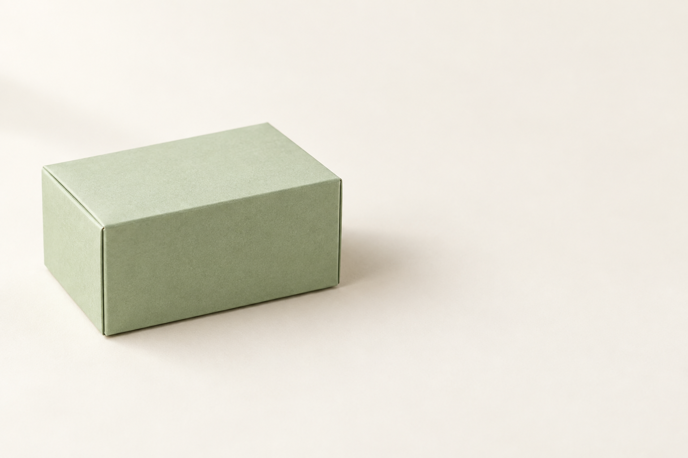
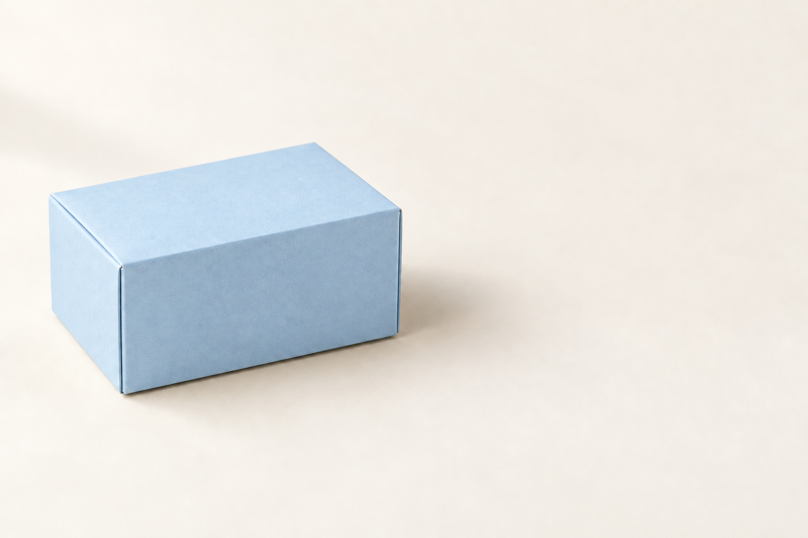

## 시안과 판매 사진을 구분합니다

가상 제품 이미지는 아이디어를 설명하거나 디자인 방향을 탐색하는 데 쓸 수 있습니다. 실재 제품의 판매 사진은 구매자가 받게 될 물건을 정확하게 보여 주어야 합니다. 생성 모델이 손잡이, 소재, 부품을 바꾸었다면 실제 제품의 증거 사진으로 사용하기 어렵습니다.

처음 연습할 때는 ‘판매 중인 상품의 사진’이 아니라 ‘가상의 무지 상자’처럼 정체성이 단순한 소재를 선택하세요. 검수의 목표도 명확해집니다. 실제 상품을 다룬다면 원본 사진과 비교해 형상, 구성품, 색, 표시 정보를 확인합니다. 보기 좋게 만들면서 중요한 정보를 바꾸지 않았는지가 핵심입니다.

## 실제 실행: 가상 상자 생성

목표는 상세 페이지의 첫 화면에 놓을 가상 종이 상자 이미지입니다. 준비물은 텍스트 생성 기능이며 외부 입력 사진은 필요 없습니다. 다음 프롬프트를 한 번 실행했습니다.

```text
가상의 무지 종이 상자 하나를 소개하는 가로 3:2 이미지를 만들어 주세요. 상자는 작은 직육면체이고 색은 차분한 연한 녹색, 표면은 무광 종이입니다. 상자 전체를 왼쪽 절반에 배치하고 오른쪽 절반은 아이보리색 빈 배경으로 남겨 주세요. 왼쪽 위에서 들어오는 부드러운 빛을 사용합니다. 글자, 로고, 리본, 다른 물건은 넣지 마세요.
```



AI 생성 이미지. Codex 내장 imagegen, 모델 ID 미공개, 2026-10-05. PNG 1536×1024, RGB. 생성 1회, 수록 1장.

충족한 조건: 연한 녹색 무광 상자가 왼쪽에 있고 오른쪽에 문구를 놓을 공간이 남았습니다. 파일 비율은 실제 3:2입니다.

달라진 점: 상자 끝이 화면 중앙선에 매우 가깝고 그림자는 오른쪽 여백 일부까지 퍼집니다.

판정: 제품 시안의 기본 조건 충족, 문구 배치 전 그림자 확인 필요.

이 요청은 제품의 모양과 재질을 정하고, 오른쪽에 설명을 넣을 자리를 남깁니다. ‘고급스러운 상품’이라는 추상적 말 대신 구체적인 표면과 색을 선택했습니다. 오른쪽이 비어 있어도 그림자가 길게 들어오면 문구 배치에 영향을 줄 수 있습니다.

## 실제 실행: 상자 색만 바꾸기

```text
첨부한 가상 종이 상자 이미지에서 상자의 색만 연한 파란색으로 바꿔 주세요. 무광 종이 재질, 상자의 형태와 모서리, 크기와 위치, 아이보리색 배경, 조명과 그림자, 가로 3:2 화면은 유지하세요. 글자, 로고, 리본, 다른 물건은 넣지 마세요.
```



AI 생성 이미지. Codex 내장 imagegen, 모델 ID 미공개, 2026-10-05. PNG 1536×1024, RGB. 생성 1회, 수록 1장.

입력 파일: `box-green-32.png`.

충족한 조건: 상자가 연한 파란색으로 바뀌었고 모서리의 방향과 위치, 오른쪽 여백은 유사하게 유지되었습니다. 파일 비율도 3:2입니다.

달라진 점: 상자 표면의 밝기와 종이 질감이 일부 달라 보입니다.

판정: 색 변경 성공, 주요 형태·배치 육안 보존.

상자 네 모서리와 면의 비율을 따라가며 비교합니다. 색은 맞아도 모서리가 휘거나 설명 공간이 줄었다면 상세 페이지용 이미지로 채택하기 전에 고쳐야 합니다.

독자 응용: 같은 상품을 세 가지 화면에 쓰려면 어떤 비율이 필요한지 먼저 표로 적습니다. 반드시 세 장을 새로 생성해야 하는 것은 아닙니다. 기존 결과를 안전하게 잘라 쓸 수 있는지 확인한 뒤 필요한 장면만 추가합니다.

[이전 페이지](050-part5.md) · [전체 목차](../TOC.md) · [다음 페이지](052-ch22.md)
