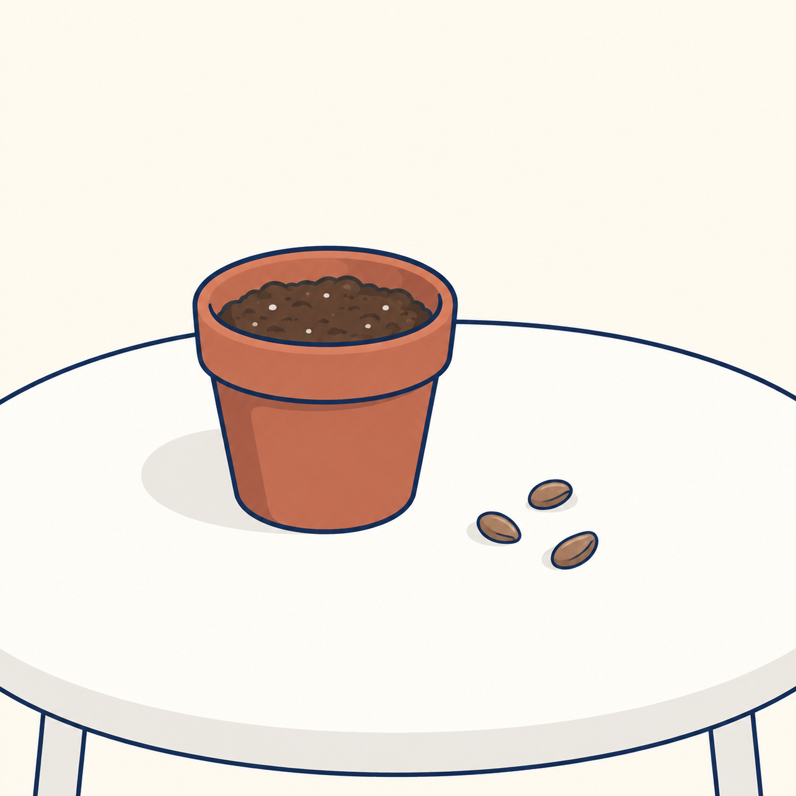
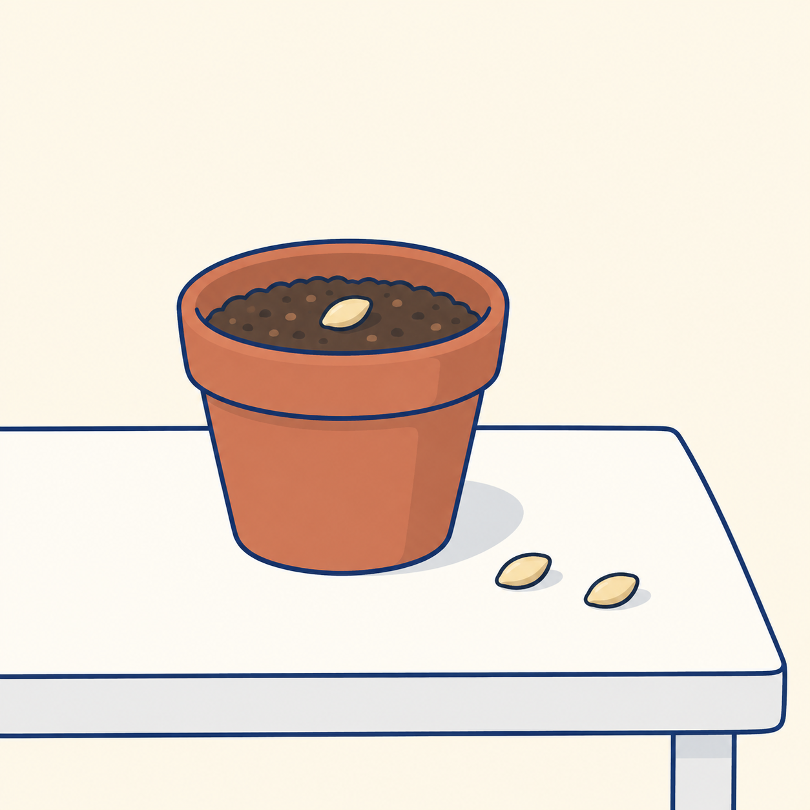

## 장면마다 하나의 역할을 줍니다

스토리보드는 이야기를 여러 장면으로 나누어 계획하는 그림입니다. 여기서는 정지 이미지 네 장으로 짧은 이야기를 구성해 봅니다. 이 책에서는 앞의 두 장면을 실제로 생성하고, 나머지 두 장면은 독자 응용으로 남깁니다.

소재는 ‘작은 씨앗을 심는 하루’입니다. 첫 장면은 준비, 둘째는 심기, 셋째는 물 주기, 넷째는 기다림을 보여 줍니다. 마지막 장면에 큰 나무를 갑자기 넣으면 같은 날의 이야기인지 긴 시간이 흐른 이야기인지 모호해집니다. 시간 흐름을 먼저 정해야 장면도 자연스럽게 연결됩니다.

| 장면 | 보여 줄 행동 | 유지할 특징 |
| --- | --- | --- |
| 1 | 흙이 든 화분과 씨앗 준비 | 붉은 갈색 화분, 흰 탁자 |
| 2 | 흙에 씨앗 놓기 | 같은 화분과 배경 |
| 3 | 작은 물뿌리개로 물 주기 | 같은 색과 빛 |
| 4 | 창가에 둔 화분 | 씨앗을 심은 직후의 상태 |

사람의 손이 들어가면 손가락과 물체의 접촉이 추가 검수 대상이 됩니다. 처음에는 행동 전후의 물체 상태만 보여 주어도 이야기를 전달할 수 있습니다. 무엇을 생략해도 의미가 유지되는지 생각해 보세요.

두 장면은 각각 텍스트만으로 생성했습니다. 장면 2에 장면 1 이미지를 첨부하지 않았으므로, 반복한 설명만으로 화분이 얼마나 이어지는지 관찰할 수 있습니다.

## 실제 실행 1: 씨앗 준비

```text
아이보리색 배경의 단순한 생활 일러스트를 만들어 주세요. 흰 탁자 위에 작은 붉은 갈색 화분 하나와 씨앗 세 알이 놓여 있습니다. 화분에는 흙이 담겨 있고 아직 싹은 없습니다. 부드러운 남색 윤곽선, 제한된 색, 정사각형 화면을 사용합니다. 글자와 사람은 넣지 마세요.
```



AI 생성 이미지. Codex 내장 imagegen, 모델 ID 미공개, 2026-10-05. PNG 1254×1254, RGB. 생성 1회, 수록 1장.

충족한 조건: 붉은 갈색 화분 하나, 흙, 탁자 위 씨앗 세 알이 보이고 싹은 없습니다.

달라진 점: 흰 탁자는 둥근 모양으로 표현됐고 화분 안 흙에는 작은 밝은 점들이 추가됐습니다.

판정: 장면 1의 대상·수량 충족.

## 실제 실행 2: 흙 위에 씨앗 놓기

```text
아이보리색 배경의 단순한 생활 일러스트를 만들어 주세요. 흰 탁자 위에 작은 붉은 갈색 화분 하나가 놓여 있습니다. 화분에는 흙이 담겨 있고 아직 싹은 없습니다. 씨앗 세 알 중 한 알은 화분의 흙 위에 놓이고 나머지 두 알은 탁자 위에 놓여 있습니다. 부드러운 남색 윤곽선, 제한된 색, 정사각형 화면을 사용합니다. 글자와 사람은 넣지 마세요.
```



AI 생성 이미지. Codex 내장 imagegen, 모델 ID 미공개, 2026-10-05. PNG 1254×1254, RGB. 생성 1회, 수록 1장.

충족한 조건: 씨앗 한 알은 흙 위, 두 알은 탁자 위에 놓였습니다. 붉은 갈색 화분과 남색 선도 이어집니다.

달라진 점: 첫 장면보다 화분이 넓고 크게 보이며 씨앗은 갈색에서 밝은 노란색으로 바뀌었습니다. 둥근 탁자도 사각 탁자로 바뀌었습니다.

판정: 상태 변화 성공, 화분·소품·배경 일관성 부분 실패.

첫 장면의 준비 상태와 둘째 장면의 씨앗 위치는 구분되지만, 같은 화분이 이어지는 장면으로 쓰려면 보완이 필요합니다. 화분의 몸체 폭·테두리·색을 비교하고 탁자 형태와 씨앗 색도 함께 고정 항목으로 기록합니다.

독자 응용: 장면 1을 기준 이미지로 첨부해 장면 2를 다시 만들어 보세요. 이후 물 주기와 기다림 장면을 설계합니다. 물이 흙에 닿는 관계, 같은 날이라는 시간 흐름, 화분의 특징을 채택 기준으로 적습니다. 장면 3·4의 실제 생성은 이 책에 수록하지 않았습니다.

[이전 페이지](https://wikidocs.net/444342) · [전체 목차](https://wikidocs.net/book/21518) · [다음 페이지](https://wikidocs.net/444363)
