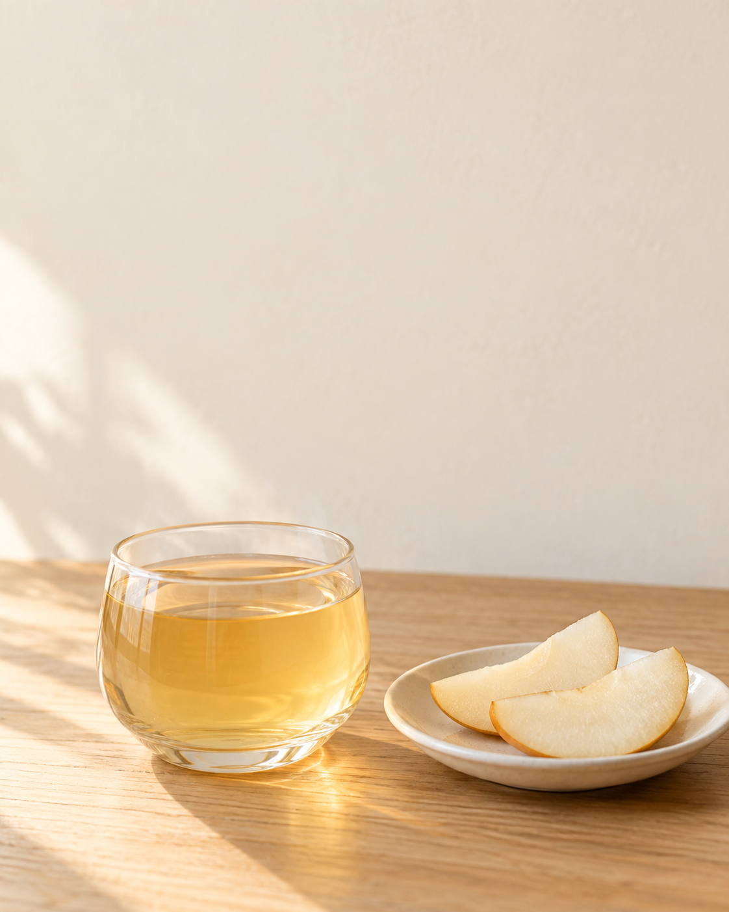

## 준비물과 전체 프롬프트

텍스트로 이미지 생성이 가능한 도구를 준비합니다. 외부 입력 사진은 사용하지 않았습니다. 아래 문장을 한 번 실행해 얻은 결과를 수록합니다.

```text
가상의 작은 카페에서 사용할 배 모과차 소개용 세로 사진을 만들어 주세요. 세로 4:5 구도입니다. 투명한 낮은 유리잔 하나에 연한 황금색 차가 담겨 있고, 잔 옆에는 얇은 배 조각 두 개가 작은 흰 접시 위에 놓여 있습니다. 잔과 접시는 화면 아래쪽 절반에 배치하세요. 상단 40퍼센트는 나중에 제목을 넣을 수 있도록 아무 물체도 없는 따뜻한 아이보리색 벽으로 비워 두세요. 바닥은 밝은 나무 탁자이며 왼쪽에서 부드러운 낮빛이 들어옵니다. 포근하지만 과장되지 않은 메뉴 사진입니다. 글자, 로고, 가격, 손, 사람, 다른 과일은 넣지 마세요.
```

대상과 보조 요소를 정한 뒤 배치를 지정했습니다. 빛은 방향과 부드러움으로 표현하고, 사진 안에 들어가면 안 되는 글자와 소품을 끝에 적었습니다. 메뉴의 이름만으로 모든 재료가 화면에 나와야 한다고 생각하지 않고, 시각적 보조 요소는 배 두 조각으로 제한했습니다.

## 실제 결과



AI 생성 이미지. Codex 내장 imagegen, 모델 ID 미공개, 2026-10-05. PNG 1122×1402, RGB. 생성 1회, 수록 1장.

차가 든 잔과 배 조각 두 개가 아래쪽에 있고 상단은 넓게 비었습니다. 벽에는 빛에 의한 변화가 있지만 물체는 없습니다. 접시가 화면 오른쪽 가장자리에 닿아 일부가 잘려 보입니다. ‘접시 전체가 보여야 한다’는 필수 조건은 이번 요청에 넣지 않았습니다. 전체 식기 형태가 중요한 작업이었다면 그 조건을 추가하고 다시 검수해야 합니다.

또한 실제 픽셀 비율은 정확한 4:5가 아닙니다. 이번 장에서는 생성 결과를 그대로 보존했습니다. 정확한 업로드 규격을 맞추는 단계는 [Chapter 29](https://wikidocs.net/444368)에서 설명합니다.

## 한 요소 수정과 독자 연습

다음 장에서는 이 결과를 입력해 글자만 추가합니다. 독자는 먼저 빈 공간이 제목 세 줄을 받아들일 수 있는지 가상의 박스를 그려 생각해 보세요. 이미지 위에 글자를 넣을 때 배경의 밝은 부분과 어두운 부분이 어디인지도 확인합니다.

응용 과제로는 같은 구조에서 음료를 보리차로 바꾸되 과일 소품을 삭제해 봅니다. 이름만 바꾸고 배를 남겨 두면 제품 구성에 대한 오해를 줄 수 있습니다. 문장마다 새 메뉴에 맞는 조건인지 다시 읽으세요.

[이전 페이지](https://wikidocs.net/444365) · [전체 목차](https://wikidocs.net/book/21518) · [다음 페이지](https://wikidocs.net/444367)
