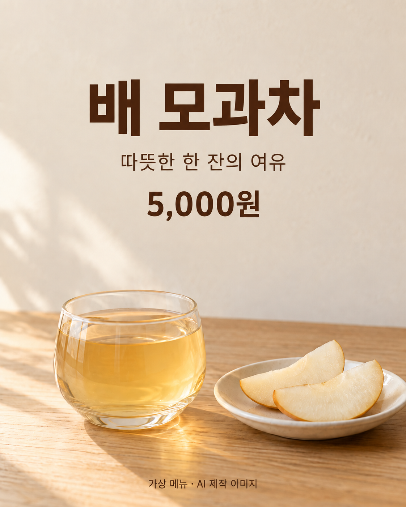

## 문구를 먼저 확정합니다

이번 가상 메뉴의 문구는 ‘배 모과차’, ‘따뜻한 한 잔의 여유’, ‘5,000원’입니다. 마지막에 ‘가상 메뉴 · AI 제작 이미지’를 넣어 교육용 시안임을 표시합니다. 실제 메뉴의 가격이나 상호를 대신하는 정보가 아닙니다.

## 실제 편집 프롬프트

```text
첨부 이미지의 빈 상단 영역에 가상 카페의 메뉴 안내 글자만 추가해 주세요. 상단 중앙에 짙은 갈색의 큰 한글 제목 '배 모과차', 그 아래 작은 글씨 '따뜻한 한 잔의 여유', 그 아래 '5,000원'을 정확하게 넣으세요. 맨 아래 여백에 작은 글씨 '가상 메뉴 · AI 제작 이미지'를 넣으세요. 글꼴은 단정하고 읽기 쉬운 고딕 계열입니다. 잔, 차, 배 조각 두 개, 접시, 탁자, 빛, 배경, 세로 구도와 화면 비율은 바꾸지 마세요. 로고나 다른 문구를 추가하지 마세요.
```



AI 편집 이미지. Codex 내장 imagegen, 모델 ID 미공개, 2026-10-05. cafe-base.png를 입력하여 한 번 편집했습니다. PNG 1122×1402, RGB입니다.

## 결과에서 확인한 것

제목, 보조 문구, 가격, 하단 안내 문구를 육안으로 대조했습니다. 제목이 가장 크고 가격이 그다음으로 강조되어 있습니다. 아래쪽 잔과 배 조각은 큰 구성 변화 없이 남아 있습니다. 가격 뒤의 ‘원’과 숫자의 쉼표도 확인해야 할 문자입니다.

생성된 글자는 편집 가능한 텍스트가 아닙니다. 가격을 바꾸려면 다시 이미지 편집을 요청하거나 글자 없는 배경에서 일반 편집 도구로 새 문구를 배치해야 합니다. 실제 운영에서 가격 변경이 잦다면 두 번째 경로를 선택하는 것이 관리하기 쉽습니다.

## 수정 한 번으로 끝내도 되는가

이번 결과는 교육용 메뉴 시안으로 채택했습니다. 다만 실제 카페에서 쓸 준비가 끝났다는 뜻은 아닙니다. 실제 메뉴와 이미지의 관계, 확정 가격, 게시 크기와 글자 가독성을 담당자가 확인해야 합니다. ‘이미지 생성 성공’과 ‘업무 사용 승인’을 다른 단계로 남겨 두세요.

독자 과제: 가상 가격을 5,500원으로 바꾸는 두 방법을 비교합니다. AI 편집으로 숫자만 바꾸는 방법과 글자 없는 배경에서 텍스트를 새로 얹는 방법입니다. 실행하지 않았다면 결과를 만들어 적지 말고, 필요한 작업과 검수 항목만 계획해도 됩니다.

[이전 페이지](062-ch27.md) · [전체 목차](../TOC.md) · [다음 페이지](064-ch29.md)
