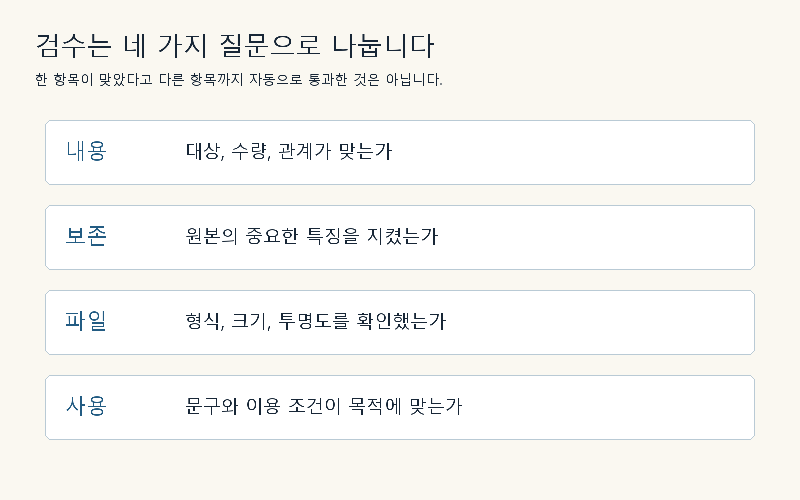

## 결과 이미지와 사용 설명을 함께 전달합니다

이미지 파일 한 장만 보내면 받는 사람은 어떤 파일이 원본이고 무엇을 수정해도 되는지 알기 어렵습니다. 작은 프로젝트라도 배경 원본, 최종 시안, 문구, 제작 기록을 구분해 전달하면 이후 수정이 편해집니다. 불필요한 계정 정보와 내부 대화는 포함하지 않습니다.

이번 프로젝트의 묶음은 다음과 같습니다.

| 파일 | 역할 | 실제 상태 |
| --- | --- | --- |
| cafe-base.png | 글자 없는 배경 | 생성·저장·속성 확인 |
| cafe-poster.png | 메뉴 문구가 있는 시안 | 편집·문구 육안 확인 |
| Chapter 26의 요청서 | 목적과 조건 | 가상 프로젝트 조건 |
| Chapter 27~28의 프롬프트 | 재현을 위한 입력 | 실제 실행 문장 |

수정 가능한 원본 디자인 파일이 없는데 있다고 적지 않습니다. 이 작업에서 제공되는 결과는 PNG입니다. ‘레이어 편집 가능’이나 ‘폰트 교체 가능’ 같은 설명은 별도 편집 파일을 만들었을 때만 붙입니다.

## 이번 결과의 판정

직접 작성한 교육용 도식입니다. 네 항목을 각각 확인한 뒤 전체 결과를 판단합니다.

교육용 시안이라는 범위에서 잔과 배 조각, 상단 문구, 가상 가격이 확인되었습니다. 정확한 4:5 업로드 파일 제작과 실제 인쇄는 실행하지 않았습니다. 이것은 생성 자체의 실패라기보다 산출물 범위를 나누어 기록한 것입니다.

인계 문장을 다음처럼 쓰면 명확합니다. ‘가상 메뉴 시안 두 장을 제공합니다. 문구와 기본 구성을 확인했습니다. 실물 메뉴와의 일치, 실제 가격 승인, 매체별 규격 조정과 인쇄 확인은 사용 단계에서 필요합니다.’ 막연히 모든 검수가 끝났다고 쓰는 것보다 받는 사람이 다음 행동을 정하기 쉽습니다.

## 독자 프로젝트의 완료 조건

독자는 다른 메뉴 하나로 요청서, 첫 프롬프트, 생성본, 한 요소 수정본, 비교 기록을 완성합니다. 실제로 실행할 수 없었다면 프롬프트 설계 과제로 제출하고 생성 프로젝트를 완료했다고 쓰지 않습니다. 이미지가 예쁘다는 것 외에 목적을 충족하는 근거 세 가지를 적으면 좋습니다.

마지막으로 원본 파일과 최종 파일을 다른 위치에 백업합니다. 실제 업무에서 삭제나 덮어쓰기로 결과를 잃으면 프롬프트가 남아 있어도 같은 이미지를 다시 얻지 못할 수 있습니다. 기록과 백업은 생성 이후에 덧붙이는 장식이 아니라 제작 과정의 일부입니다.

[이전 페이지](064-ch29.md) · [전체 목차](../TOC.md) · [다음 페이지](070-part7.md)
